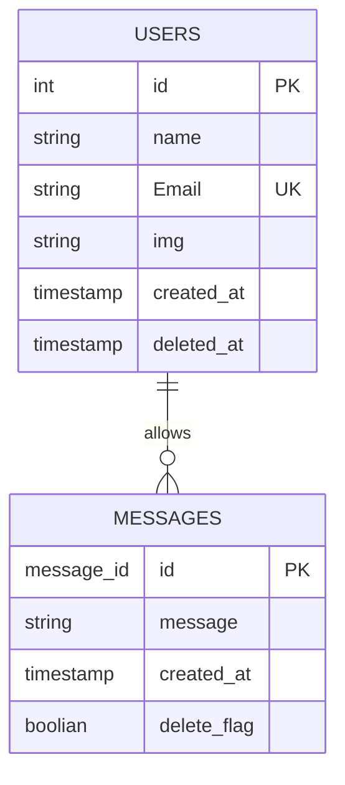

# インストール手順

## 1. flask インストール

```python
pip install flask flask-socketio
or
python -m pip install flask flask-socketio
```

## 2. simple-websocket

`python -m pip install -U simple-websocket`

## 3. ファイル作成

```powershell
mkdir webapp
cd webapp
mkdir templates
new-item templates\index.html
new-item app.py

```

# 起動手順

` python .\app.py`

# ファイル構成

```scss
python_web
│
├─ app.py
│
└─ templates
   │
   └─ index.html


```

# 設計書

## DB



```yaml
your_project/
├─ application/
│   ├─ __init__.py: アプリケーションの初期化と設定を行う。
│   ├─ models/
│   │   ├─ __init__.py: モデルディレクトリの初期化ファイル。
│   │   ├─ chat.py: チャットに関連するデータベースのモデル定義と操作を記述。
│   │   └─ login.py: ログインに関連するデータベースのモデル定義と操作を記述。
│   └─ templates/
│       ├─ index.html: アプリケーションのトップページのテンプレート。
│       └─ chat.html: チャット一覧ページのテンプレート。
├─ tests/
│   ├─ __init__.py: テストディレクトリの初期化ファイル。
│   └─ test_chat.py: チャット機能のテストコードを記述。
├─ static/
│   ├─ css/
│   │   └─ styles.css: 共通のスタイルシート。
│   ├─ js/
│   │   └─ chat.js: チャットページで使用するJavaScriptコード。
│   └─ images/
│       └─ logo.png: アプリケーションのロゴ画像。
├─ migrations/
│   └─ 001_initial_migration.py: 初期のデータベースマイグレーションファイル。
├─ config.py: アプリケーションの設定を管理する。データベース接続情報などを含む。
├─ wsgi.py: アプリケーションのエントリーポイント。Flaskアプリケーションの起動と実行を行う。
├─ README.md: プロジェクトの説明、セットアップ手順、使用方法などを記述。
└─ .gitignore: Gitバージョン管理から除外するファイルや/models


```