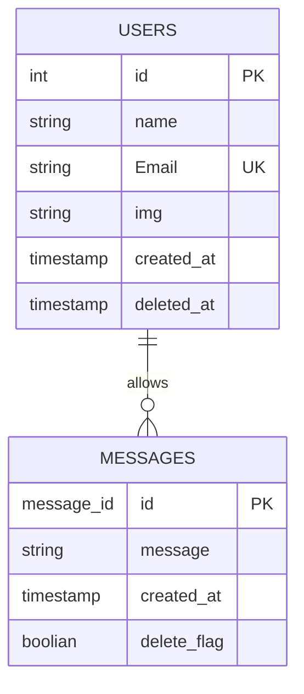

# インストール手順

## 1. flask インストール

```python
pip install flask flask-socketio
or
python -m pip install flask flask-socketio
```

## 2. simple-websocket

`python -m pip install -U simple-websocket`

## 3. ファイル作成

```powershell
mkdir webapp
cd webapp
mkdir templates
new-item templates\index.html
new-item app.py

```

# 起動手順

` python .\app.py`

# ファイル構成

```scss
python_web
│
├─ app.py
│
└─ templates
   │
   └─ index.html


```

# 設計書

## DB


