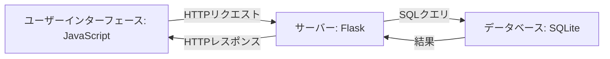
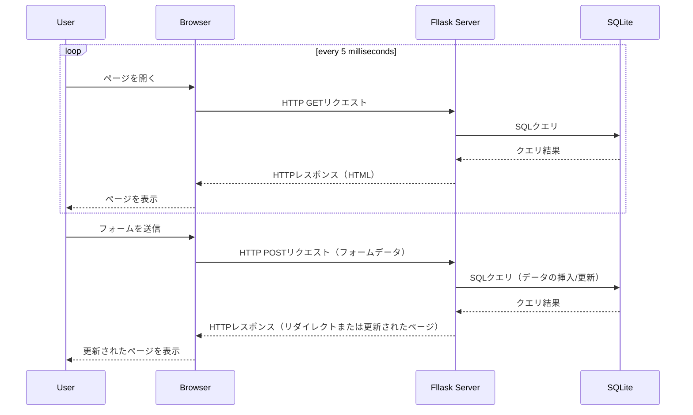

# 概念設計

## 

```mermaid
graph LR
    A[ユーザーインターフェース: JavaScript]
    B[サーバー: Flask]
    C[データベース: SQLite]
    A[ユーザーインターフェース: JavaScript] -->|HTTPリクエスト| B[サーバー: Flask]
    B -->|SQLクエリ| C[データベース: SQLite]
    C -->|結果| B
    B -->|HTTPレスポンス| A


```
## 送受信処理
- Get：メッセージ受信
- Post：メッセージ送信

```mermaid
sequenceDiagram
    participant ユーザー as User
    participant ブラウザ as Browser
    participant サーバー as Fllask Server
    participant データベース as SQLite

    Loop every 5 milliseconds
        ユーザー->>ブラウザ: ページを開く
        ブラウザ->>サーバー: HTTP GETリクエスト
        サーバー->>データベース: SQLクエリ
        データベース-->>サーバー: クエリ結果
        サーバー-->>ブラウザ: HTTPレスポンス（HTML）
        ブラウザ-->>ユーザー: ページを表示
    End
    
    ユーザー->>ブラウザ: フォームを送信
    ブラウザ->>サーバー: HTTP POSTリクエスト（フォームデータ）
    サーバー->>データベース: SQLクエリ（データの挿入/更新）
    データベース-->>サーバー: クエリ結果
    サーバー-->>ブラウザ: HTTPレスポンス（リダイレクトまたは更新されたページ）
    ブラウザ-->>ユーザー: 更新されたページを表示

```
