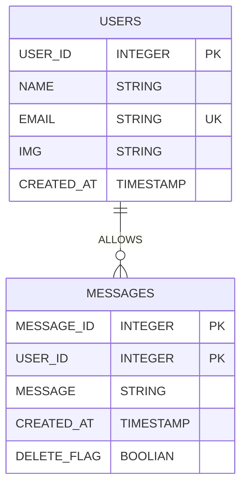

# 詳細設計書

## データベース設計

### テーブル詳細
ユーザテーブル
| 列名       | データ型    | 制約  | 説明     |
| -------- | ------- | --- | ------ |
| ID       | INTEGER | PK  | ユーザ識別子 |
| NAME     | TEXT    |     | ユーザの名前 |
| EMAIL    |  TEXT       |   UK  | ユーザメールアドレス       |
| PASSWARD | TEXT       |     |パスワード        |
| IMG      |  TEXT              |     | 画像パスを保存        |
| CREATED_AT    |TIMESTAMP      |     |        |

| 列名         | データ型 | 制約  | 説明  |
| ---------- | ---- | --- | --- |
| MESSAGE_ID |    TEXT  |  PK   |     |
| USER_ID    |    TEXT  |     |     |
| MESSAGE    |    TEXT  |     |     |
| CREATED_AT |     TIMESTAMP |     |     |
|  DELETE_FLAG          | BOOLEAN     |     |     |

### ER図
