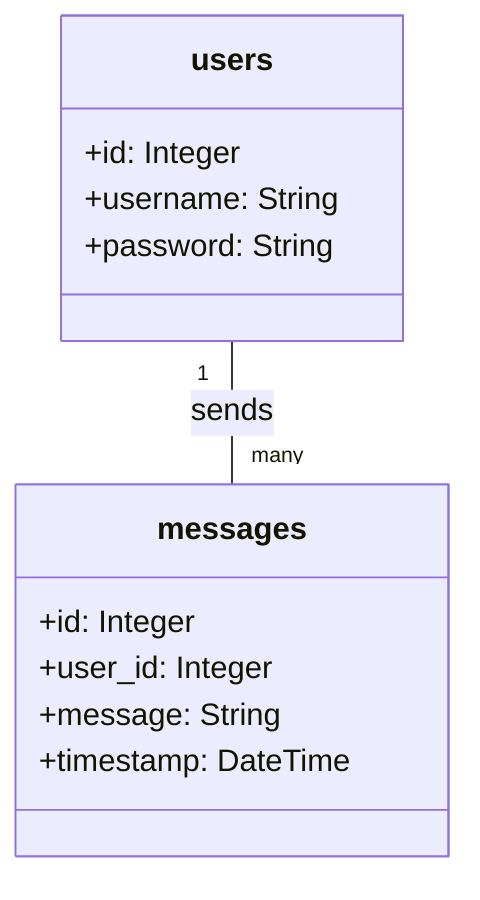

以下に、上記の情報を表形式でまとめてみました。

| ノード名        | 説明                                                                 |
|-----------------|----------------------------------------------------------------------|
| Root            | プロジェクトのルートディレクトリ。全てのファイルとディレクトリを含む。  |
| application     | メインアプリケーションのコードを含むディレクトリ。                      |
| routes          | Flaskのルート定義を含むディレクトリ。                                 |
| templates       | FlaskのHTMLテンプレートを含むディレクトリ。                           |
| __pycache__     | Pythonがキャッシュファイルを格納するディレクトリ。                     |
| models          | データベースモデルの定義を含むディレクトリ。                          |
| static          | 静的ファイル (CSS, JavaScript, 画像など) を含むディレクトリ。        |
| css             | CSSファイルを含むディレクトリ。                                       |
| js              | JavaScriptファイルを含むディレクトリ。                                |
| docs            | プロジェクトのドキュメントを含むディレクトリ。                        |

3. **詳細設計書（Detailed Design）**

# Detailed Design

## Database Schema

The application uses SQLite for the database. The database consists of two tables: `users` and `messages`.

    ## API Endpoints

- `/register`: Handles user registration.
- `/login`: Handles user login.
- `/send`: Handles sending of messages.
- `/receive`: Handles receiving of messages.
