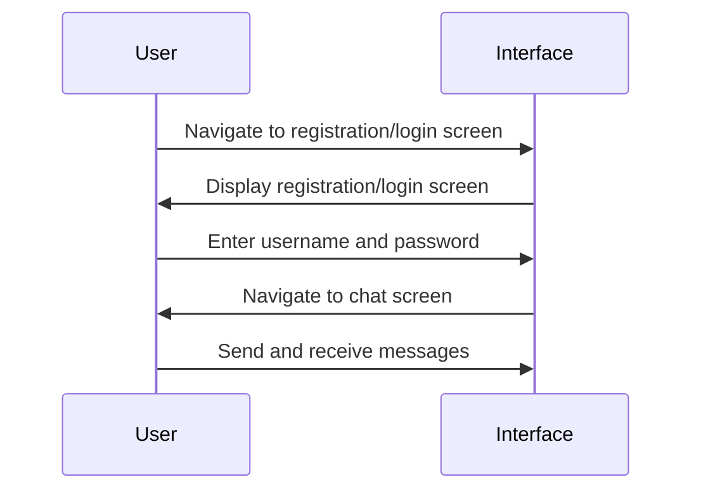

4. **UI/UX 設計書（UI/UX Design）**

# UI/UX Design

The user interface consists of a registration/login screen and a chat screen.

```mermaid
sequenceDiagram
    participant User
    participant Interface
    User->>Interface: Navigate to registration/login screen
    Interface->>User: Display registration/login screen
    User->>Interface: Enter username and password
    Interface->>User: Navigate to chat screen
    User->>Interface: Send and receive messages
```

